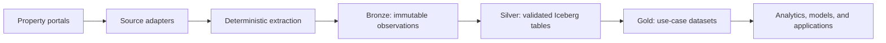

# VLC Market Oracle

VLC Market Oracle is an early-stage real-estate data platform for Valencia and, later, the wider
Comunidad Valenciana. Its goal is to collect traceable listing snapshots from property portals,
starting with Idealista, and publish clean, historized data through an Apache Iceberg lakehouse.

> **Project status:** foundation and exploration. The workflow, planning templates, and
> exploratory scraper notebooks exist. Production ingestion, Iceberg tables, infrastructure, and
> analytical products are not implemented yet.

## Why this project exists

Property portals show the current asking market, but they do not provide a reusable history of how
individual listings and local market conditions change over time. A trustworthy analytical
foundation requires more than a one-time scrape: raw observations must remain replayable, changes
must retain their temporal meaning, and every derived value must be traceable to its source.

VLC Market Oracle therefore treats the data platform as the product foundation. Collection and
domain models should remain independent of any single analytical use case or portal.

## Candidate use cases

These are roadmap options, not committed features:

1. **Fair-price estimation** — estimate a property's likely asking-market value and identify
	listings that appear relatively inexpensive or expensive.
2. **Fix-and-flip potential** — detect renovation signals and estimate the spread to comparable
	renovated properties.
3. **Buy-to-let yield maps** — combine sale and rental observations to estimate local gross yields.
4. **Listing liquidity** — estimate time on market from repeated observations and listing state.
5. **Market-dynamics analysis** — identify changing neighborhood clusters and possible
	gentrification signals without confusing correlation with causation.

The platform records asking-market observations, not completed transaction prices. A disappeared
listing is not evidence that a property was sold or rented.

## Target architecture



| Boundary | Responsibility |
| --- | --- |
| Source adapters | Acquire approved portal pages or responses and isolate source-specific rules. |
| Extraction | Convert source payloads into explicit listing snapshots while preserving provenance. |
| Bronze | Retain immutable raw observations and ingestion metadata for replay. |
| Silver | Validate, normalize, deduplicate, and historize records in Apache Iceberg. |
| Gold | Publish versioned features, aggregates, and training datasets for selected use cases. |
| Consumers | Query curated contracts without depending on scraper internals. |

Concrete cloud services, the Iceberg catalog, compute engines, and deployment topology remain open
until a reviewed feature establishes their requirements and cost.

## Data principles

- Preserve source, listing identifier, source event time when available, observation time,
  ingestion time, and transformation version.
- Store timestamps in UTC and distinguish publication, observation, and ingestion events.
- Make ingestion idempotent so retries do not duplicate or corrupt observations.
- Evolve Iceberg schemas and partitions deliberately; do not encode a lakehouse as ad hoc folders.
- Record currency and measurement units explicitly and avoid binary floating-point for money.
- Keep raw facts separate from inferred labels, predictions, and causal claims.
- Minimize personal-data collection and exclude unnecessary personal information from fixtures,
  logs, analytical tables, and model features.

## Responsible collection

Collection must respect applicable law, portal terms, robots directives, and configured rate limits.
The project does not bypass authentication, CAPTCHAs, access controls, or anti-bot protections.

HTTP acquisition and deterministic parsing belong in separate components. Default tests use small
recorded, synthetic, or redacted fixtures and never access a live portal. Any explicitly approved
live experiment must be optional, bounded, rate-limited, identifiable where required, and safe to
stop. Secrets and unnecessary page content must not appear in source control or logs.

## Current repository state

- [src/notebooks/idealista_selenium_scraper.ipynb](src/notebooks/idealista_selenium_scraper.ipynb) is an
  exploratory learning notebook, not a production collector or automated test. It contains live
  browser automation and should not be run as part of the default development workflow.
- [src/notebooks/idealista_playwright_scraper.ipynb](src/notebooks/idealista_playwright_scraper.ipynb)
	contains a separate Playwright experiment, synthetic extraction checks and opt-in HTTP diagnostics.
- [`infra/`](infra/) contains the intended infrastructure layout but no implemented resources yet.
- [`dev/plans/`](dev/plans/) contains the feature workflow and templates. No real feature is
  currently registered.
- [`tests/`](tests/) covers workflow consistency, the Playwright listing contract and sanitized
	navigation diagnostics using fake or intercepted responses, never live portal requests.

The notebook still contains inherited feature references and experimental assumptions. Treat its
results as provisional evidence until a registered feature reviews and replaces them with small,
reproducible fixtures and tested production modules.

## Repository layout

```text
.
├── .github/
│   ├── agents/                 # Architect, Reviewer, and Implementer definitions
│   └── copilot-instructions.md # Project-wide engineering rules
├── dev/
│   ├── plans/                  # Feature registry, plans, and technical plans
│   ├── reviews/                # Independent feature reviews
│   └── tools/                  # Workflow validation
├── docs/                       # Project documentation
├── infra/                      # Infrastructure as code, currently scaffolded
├── src/
│   └── notebooks/              # Exploratory and feature-specific MVP notebooks
└── tests/                      # Automated tests
```

Production behavior belongs in importable modules under `src/`, not in notebooks.

## Development workflow

Non-trivial features use the documented
[Architect -> Reviewer -> Implementer workflow](.github/agents/WORKFLOW.md):

1. `@architect <goal>` establishes ground truth, creates a feature plan, and produces one reduced
	Jupyter MVP when it provides meaningful evidence.
2. `@reviewer Review FEATURE-XXX` verifies the plan and notebook evidence. Only an approved review
	emits an executable technical plan.
3. `@implementer Implement FEATURE-XXX` executes one bounded task at a time using
	red-green-refactor TDD.

Notebook MVPs are learning and feasibility artifacts. They do not replace automated tests and must
not become a parallel production implementation.

### Local notebook environment

The exploratory Idealista notebook currently requires Python 3.12, Google Chrome, and the packages
declared in [`requirements-notebook.txt`](requirements-notebook.txt). Create the project-local
environment and kernel with:

```bash
python3 -m venv .venv
.venv/bin/python -m pip install --upgrade pip
.venv/bin/python -m pip install -r requirements-notebook.txt
.venv/bin/python -m ipykernel install --user \
	--name vlc-market-oracle \
	--display-name "Python (vlc-market-oracle)"
```

In VS Code, select `Python (vlc-market-oracle)` as the notebook kernel. The `.venv` directory is
local and ignored by Git.

The Selenium notebook's first code cell opens Chrome and accesses a live property URL. Review the
target site's terms and the project's responsible-collection rules before running it. Do not include
that cell in automated or unattended runs.

### Playwright failure diagnosis

In [the Playwright notebook](src/notebooks/idealista_playwright_scraper.ipynb), execute cells 2–5
to load current definitions; cell 7 validates synthetic data with page-resource requests blocked.
For one approved live attempt, review the URL and `RUN_LIVE` in cell 9, execute it, then execute
cell 10 once. Do not use **Run All** without reviewing the live flag.

Cell 10 prints a JSON `diagnostic_report` on success or failure, using evidence captured before
browser cleanup loses the response. It records UTC capture time, failure stage, browser/package versions, main-document
response sequence and status codes, selected operational headers, and fixed response-body markers.
The report remains in kernel memory after cleanup; save the notebook to retain the printed output.
No additional navigation or retries are introduced. Browser redirects and subresources can still
make additional HTTP requests during the one explicit navigation.

Cookies, authorization headers, raw HTML, screenshots and HAR files are not recorded. URL credentials,
queries, fragments and unknown paths are removed; token-bearing provider headers contribute only
their names. Selected headers may contain request IDs: review reports before sharing them.
Body inspection waits at most three seconds and scans only the first 128 Ki characters; unavailable
or truncated bodies are indicated. Playwright still materializes the response text in memory.

A 403, provider name or browser-version difference is evidence, not a proven server-side cause.
Request IDs and UTC timestamps may allow the provider to identify its decision in server logs.
The historical Selenium output does not include comparable HTTP evidence. The existing browser
configuration and HTTP/challenge stopping behavior are not relaxed by the diagnostic collector.

Run the checks currently available in the repository:

```bash
python -m unittest discover -s tests -v
python dev/tools/validate_workflow.py
```

The notebook requirements are exploratory only; no production application dependency manifest or
run command exists yet. Each future feature must document and test the setup it introduces instead
of relying on undeclared local dependencies.

## Engineering priorities

When requirements compete, prefer:

1. correctness and data integrity;
2. legal and ethical collection;
3. simplicity and readability;
4. maintainability;
5. performance supported by evidence.

Use OOP, SOLID, and design patterns as design checks, not as class quotas. Prefer pure functions for
small stateless transformations, composition over inheritance, and abstractions only where current
variants or external boundaries justify them.

## License

This project is available under the [MIT License](LICENSE).
