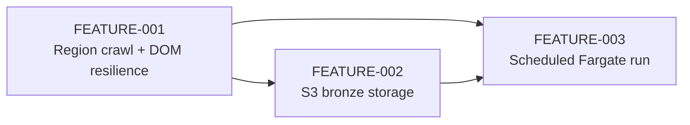

# Feature planning workflow

Feature plans for this repository, produced by the **Architect · Review · Implement** workflow
(see [`.github/agents/WORKFLOW.md`](../../.github/agents/WORKFLOW.md)). This file is the feature
registry, not a speculative roadmap: add a row only when its top-level plan exists.

## Registered features

| ID | Title | Status | Branch | Effort | Priority | Owner |
| --- | --- | --- | --- | --- | --- | --- |
| FEATURE-001 | [Region-wide Idealista collection with drift-resistant extraction](FEATURE-001-region-listing-crawl.md) | 🔵 Planned | `feature/region-listing-crawl` | L (~12h) | High | Leopold |
| FEATURE-002 | [Bronze persistence of listing data in S3](FEATURE-002-s3-bronze-storage.md) | 🔵 Planned | `feature/s3-bronze-storage` | M (~5h) | High | Leopold |
| FEATURE-003 | [Scheduled collection run as a container on AWS Fargate](FEATURE-003-scheduled-container-run.md) | 🔵 Planned | `feature/scheduled-container-run` | M (~6h) | Medium | Leopold |

The illustrative technical-plan example under `technical/` is not a registered feature.

### Status

- 🔵 **Planned:** a plan exists, but no implementation task has started.
- 🟡 **In progress:** at least one implementation task has started and not all tasks are complete.
- 🟢 **Complete:** all approved tasks and required checks are complete.
- 🔴 **Blocked:** work cannot proceed; the owning plan or review names the blocker and decision owner.

Use the next unused numeric ID. Never reuse an ID from an existing plan, review, technical plan, or
Git history. Keep titles outcome-focused; do not encode an implementation pattern such as OOP,
Lambda, or Fargate unless that technology is itself the approved requirement.

## Dependencies



An edge `A --> B` means B cannot deliver its stated outcome until A is complete. FEATURE-002 needs
the record contracts from FEATURE-001; FEATURE-003 needs both a runnable batch entry point and a
storage target.

## Workflow at a glance

1. **Architect** — `@architect <goal>` writes `FEATURE-XXX-<slug>.md`, gathers evidence for any
    assumption the repository cannot settle, and registers the feature here.
2. **Review** — `@reviewer Review FEATURE-XXX` always emits the review and, only when approved, the
    executable technical plan.
3. **Implement** — `@implementer Implement FEATURE-XXX` executes one approved TDD task at a time and
    keeps task and aggregate status synchronized.
4. **Ship** — push, open a PR, deploy, or migrate only when the user explicitly requests it.

## Where things live

- **Plans:** `dev/plans/FEATURE-XXX-<slug>.md`
- **Exploratory notebooks, when a feature uses one:** `src/notebooks/`
- **Reviews:** `dev/reviews/REVIEW-FEATURE-XXX.md`
- **Technical plans (executable):** `dev/plans/technical/FEATURE-XXX-technical-plan.yaml`
- **Implementation notes (optional):** `dev/plans/implementations/`

## Status source of truth

Before approval, the top-level feature plan owns its status. After the Reviewer emits a technical
plan, that YAML is authoritative for task progress; this registry and the top-level plan mirror its
aggregate status. Never mark a feature complete from code presence alone.

Run the consistency check after changing workflow artifacts and before an implementation handoff or
PR:

```bash
python dev/tools/validate_workflow.py
```

## Branch naming

- `feature/<feature-slug>` — optional integration branch named in the approved technical plan.
- `feature/<feature-slug>/<phase>.<step>-<desc>` — one branch per approved implementation task.
- `bugfix/<desc>` · `refactor/<desc>` · `docs/<topic>` · `test/<desc>` — work outside the feature
    workflow.

Branch creation and commits require an approved technical plan or an explicit user request. Pushes,
PRs, deployments, and migrations always require an explicit user request.
